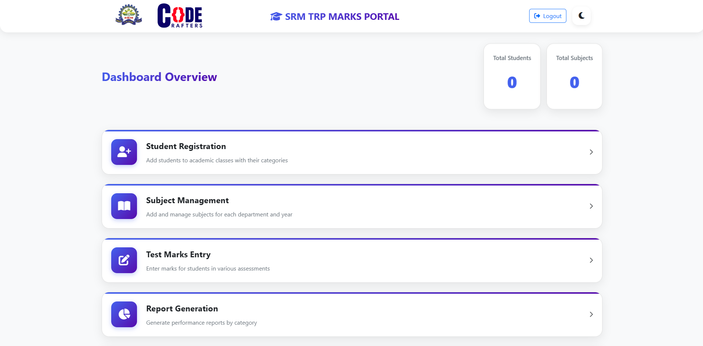
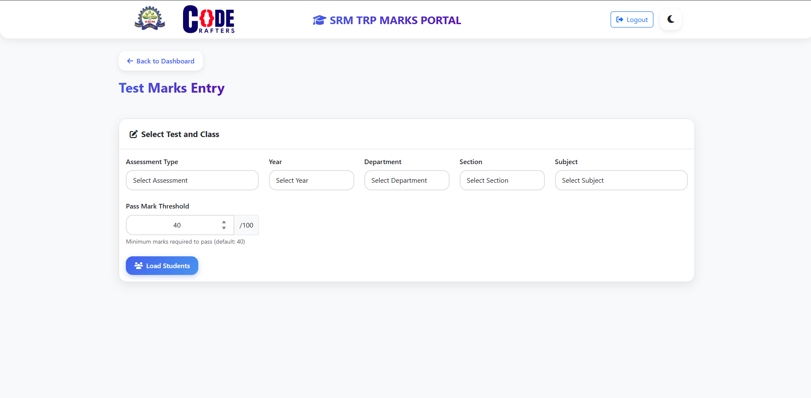
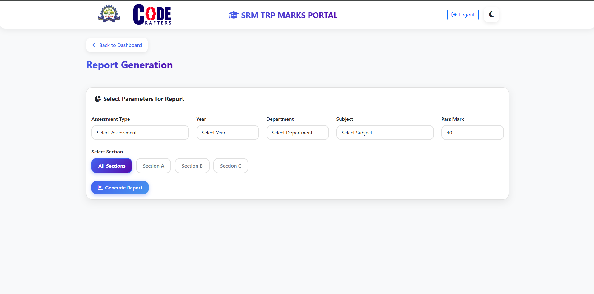

# 🎓 Student Performance Management System — SRM TRP Marks Portal

<p align="center">
  
</p>

<p align="center">
  <a href="#"></a>
  <a href="#"></a>
  <a href="#"></a>
  <a href="#"></a>
</p>

---

> A modern, fast and easy-to-use web application for SRM TRP Engineering College to manage student records, record marks, visualize performance, and export professional Excel reports.

---

## 📄 Table of Contents
- [Features](#-features)
- [Tech Stack](#-tech-stack)
- [Screenshots](#-screenshots)
- [Quick Start](#-quick-start)
- [API Endpoints](#-api-endpoints)
- [Excel Export](#-excel-export)
- [Theme & UX](#-theme--ux)
- [Deployment](#-deployment)
- [Contributing](#-contributing)
- [License](#-license)

---

## ✨ Features

### Core
- ✅ Student registration (manual + bulk Excel import)
- ✅ Subject & hierarchical management (Year → Dept → Section)
- ✅ Marks entry with instant pass/fail evaluation
- ✅ Dashboard: live statistics & charts (Chart.js)
- ✅ Export professional Excel reports (SheetJS)

### Advanced
- 🎯 Bulk operations (mass upload/edit/deletes)
- 🌗 Dark / Light theme (persists to browser)
- ⚡ Client-side processing for snappy UI
- 🔍 Filterable, exportable reports per department/year/section

---

## 🛠 Tech Stack

**Frontend**
- HTML5, CSS3, JavaScript (ES6+)
- Bootstrap 5, Chart.js, SheetJS (xlsx)

**Backend**
- Node.js, Express.js
- SQLite (lightweight, file-based)
- RESTful API design

---

## 📸 Screenshots

| Dashboard | Marks Entry | Reports |
|---:|:---:|:---:|
|  |  |  |

> Tip: Replace the `public/assets/*.png` placeholders with real screenshots or a demo GIF (`public/assets/demo.gif`).

---

## 🚀 Quick Start

### Prerequisites
- Node.js v14+  
- npm (comes with Node)

### Install & Run
```bash
# clone (if you haven't)
git clone https://github.com/<your-username>/SRM_TRP_Marks_Portal.git
cd SRM_TRP_Marks_Portal

# install dependencies
npm install

# start (development)
npm run dev   # or `npm start` if configured

# visit
http://localhost:3000
